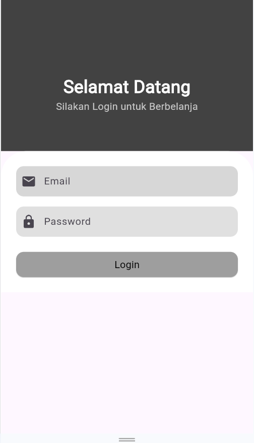
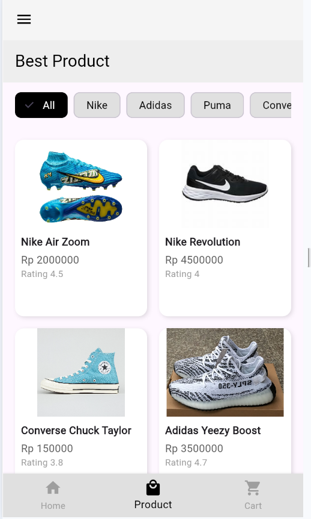
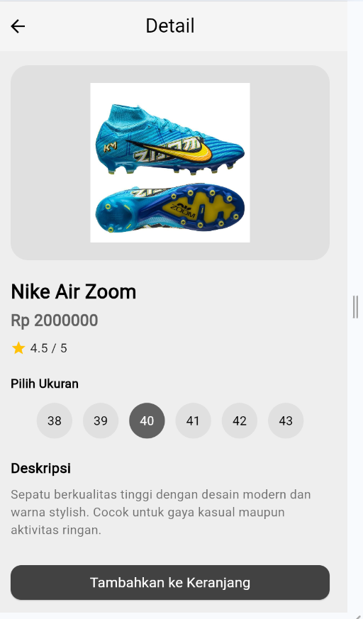
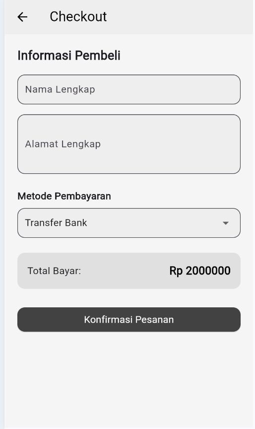
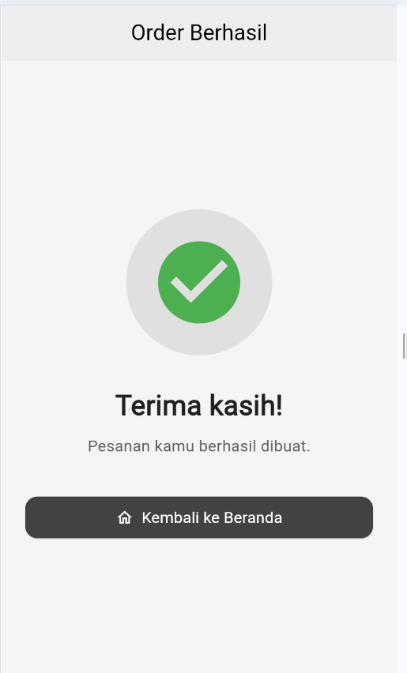

# 🕰️ Watch Order App - UTS Pemrograman Mobile

## 👤 Informasi Mahasiswa

- **Nama**: [Ari Setiawan]
- **NIM**: [2022804148]
- **Prodi**: [Sistem Informasi 6A (pagi)]
- **Semester**: [6]

---

## 📝 Nama Aplikasi

Aplikasi Flutter ini dibuat sebagai Ujian Tengah Semester (UTS) untuk mata
kuliah Mobile Programming.
Aplikasi ini merupakan aplikasi kategori dan pemesanan sepatu.

## 📝 Deskripsi  Aplikasi

> Aplikasi pemesanan sepatu yang menampilkan kategori produk sepatu dengan tampilan sederhana dan modern.
> Pengguna dapat melihat berbagai pilihan sepatu, memilih **merek sepatu** dan **ukuran**, lalu melakukan pemesanan.  
> Aplikasi ini juga menyediakan dua metode pembayaran: **Cash on Delivery (COD)** dan **Transfer Bank**.

## 📸 Screenshot Aplikasi

> ✨ *Berikut adalah beberapa tampilan dari aplikasi Watch Order App:* ✨

  
*Tampilan halaman saat membuka aplikasi*

  
*Tampilan halaman utama dengan menampilkan semua produk sepatu*

  
*Tampilan pemilihan ukuran sepatu*

  
*Halaman pemesanan*

  
*Halaman pembayaran produk*

  
*Halaman selesai pemesanan*

